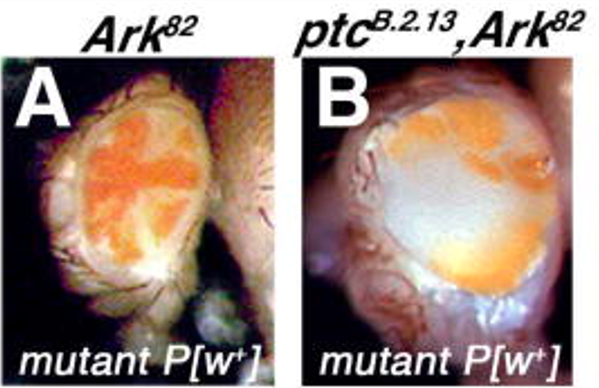
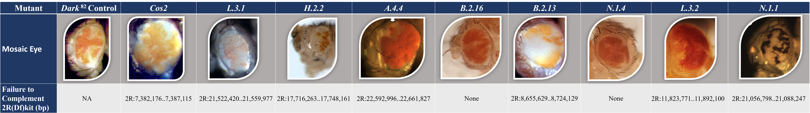

# Fly-CURE Overview

The Fly-CURE is a consortium of diverse universities and colleges across the US teaching a Course-Based Undergraduate Research Experience (Fly-CURE). The Fly-CURE is a 10-15 week undergraduate research experience where students characterize and map a novel mutant stock of _Drosophila melanogaster_. Students use techniques in classical and molecular genetics as well as bioinformatics during a semester long lab course (Fig. 1).

Figure 1: Overview of Fly-CURE. Step 1 includes utilizing the _Ey>Flp/FRT_ system to screen for cell overgrowth. 1A. _w;FRT42D,Dark82,/CyO X w, Ey>FLP;FRT42D_ 1B. _w;FRT42D,Dark82,EMS/CyO X w, Ey>FLP;FRT42D_. Step 2 is a model of complementation mapping conducting utilizing the BDSC 2R deficiency kit. Locations that fail to complement are further assessed by additional mapping. Step 3 includes various molecular techniques including DNA extraction, primer design, polymerase chain reaction (PCR), sanger sequencing, and bioinformatic analysis to identify a heterozygous single nucleotide polymorphism (SNP).  

# Genetic screen

_Drosophila_ EMS mutants were screened in the background of blocked apoptosis (_Dark82_) to search for genetic regulators of cell growth and cell division (Fig. 2). The Fly-CURE was developed to have undergraduate researchers map these novel _Drosophila_ mutants. The mutation that we are studying is recessive lethal. Heterozygotes have normal growth control and homozygous mutants are dead. In order to observe the phenotype in Fig. 2, a genetic 'trick' is used to induce mitotic recombination to generate homozygous mutant patches of cells only in the eye (which is not required for fly survival), while the rest of the animal remains heterozygous for the mutation. The growth control and mutant phenotype can then be studied by examining the eye tissue.  

Figure 2: Example of a mosaic mutant identified in the genetic screen. [Kagey et al. 2012 Mech. of Dev.](https://pubmed.ncbi.nlm.nih.gov/22705500/)

# Complementation mapping and molecular analyses

Once a mutant is identified, students complete complementation mapping utilizing the Bloomington Deficiency Stock Center (BDSC) 2R deficiency kit. This kit allows for localization of the genomic location of the EMS mutant. Additional rounds of complementation mapping may be utilized to map to predicted alleles allowing for more precise primer design for the polymerase chain reaction (PCR). After PCR amplification, Sanger sequencing and bioinformatic analysis is conducted to identify the SNP generated by EMS.  

# Outcomes

To-date, this project has provided research exposure to over 300 undergraduate researchers within the classroom setting. These undergraduate researchers have successfully mapped several EMS mutants which have led to local and national scientific presentations by students, as well as four peer-reviewed publications (Fig. 3).  

Figure 3: Mutants mapped by undergraduate researchers and Fly-CURE µ-publications. Authors include faculty from five universities and colleges with more than 100 undergraduate researchers.

# Whole-Genome Sequencing

Some EMS mutants have proven difficult to map utilizing the techniques in the Fly-CURE. As a result, funding was obtained to conduct whole-genome sequencing (WGS) on the _ark_ control and 9 EMS mutant stocks. There was uncertainty about whether WGS was going to be successful due to the presence of a balancer chromosome which prevents recombination. Recombination is often utilized in a bioinformatics pipeline to identify SNPs.  

Figure 4: Images of the _ark_ control and the 9 EMS mutants that were sequenced for this study.

# Objective

The primary objective is to utilize a genomics pipeline to identify the causative SNP in 9 EMS mutants (Fig. 5). We will be using many of the skills and tools you have previously utilized in the shell genomics and wrangling genomics lessons.

Figure 5: Genomics pipeline to identify the causative SNP in EMS _Drosophila melanogaster_ mutants.
