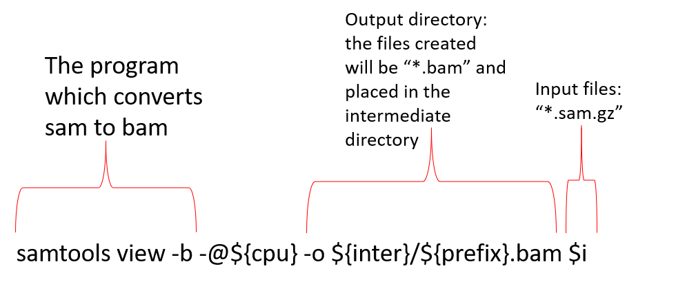
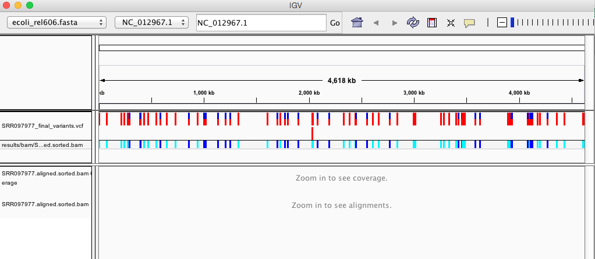

# SAM/BAM format
The [SAM file](https://genome.sph.umich.edu/wiki/SAM),
is a tab-delimited text file that contains information for each individual read and its alignment to the genome. While we do not
have time to go into detail about the features of the SAM format, the paper by
[Heng Li et al.](http://bioinformatics.oxfordjournals.org/content/25/16/2078.full) provides a lot more detail on the specification.

**The compressed binary version of SAM is called a BAM file.** We use this version to reduce size and to allow for *indexing*, which enables efficient random access of the data contained within the file.

We will convert the SAM file to BAM format using the `samtools` program with the `view` command and tell this command that the input is in SAM format and to output BAM format (`-b`):

~~~
$ cd ~/data/FlyCURE/scripts
$ nano sam_bam.sh
~~~

We are going to begin building a series of `for` loops to work our way through a series of steps that will convert or SAM files to BAM files, sort the BAM files, remove PCR duplicates, and index the BAM files prior to generating variant calls.

## Step 1: SAM to BAM Conversion
We are going to start with comments and then some criteria we will utilize for all of the upcoming `for` loops. As long as we run the scripts in order, we can make an intermediate directory to hold the files as an output for one step which becomes the input for the next step. By doing this, we can minimize how many different directories are created during the analyses. We will also add in some `echo` lines so that we can visually see that the process is occurring properly. For the SAM to BAM conversion, we are going to use samtools view as we have for a previous lesson.  

 
 Figure 1: A break down of the samtools view command.

~~~
#!/bin/bash

# what I do: sam to bam conversion

# run me in the folder with sam.gz files (~/data/FlyCURE/results/bwa_out)

# $i = each of the .sam.gz files that were created during the first alignment step and are used as the input files

cpu=4

inter='../intermediate_bams'
mkdir -p $inter

clean='../clean_bams'
mkdir -p $clean

#this loop converts sam to bam
for i in *.sam.gz; do
  echo "converting $i to bam file"
  prefix=$(basename $i .sam.gz)
  echo samtools view -b -@${cpu} -o ${inter}/${prefix}.bam $i
  samtools view -b -@${cpu} -o ${inter}/${prefix}.bam $i &
done
~~~
{: .bash}

~~~
$ chmod +x sam_bam.sh
$ cd ~/data/FlyCURE/results/bwa_out
$ ../../scripts/sam_bam.sh
~~~
{: .bash}

What you should see when the samtools view starts running. This script should run quickly.
~~~
converting A44.sam.gz to bam file
samtools view -b -@4 -o ../intermediate_bams/A44.bam A44.sam.gz
converting B-2-13_S1.sam.gz to bam file
samtools view -b -@4 -o ../intermediate_bams/B-2-13_S1.bam B-2-13_S1.sam.gz
converting B-2-16_S2.sam.gz to bam file
samtools view -b -@4 -o ../intermediate_bams/B-2-16_S2.bam B-2-16_S2.sam.gz
converting Control.sam.gz to bam file
samtools view -b -@4 -o ../intermediate_bams/Control.bam Control.sam.gz
converting cos2.sam.gz to bam file
samtools view -b -@4 -o ../intermediate_bams/cos2.bam cos2.sam.gz
converting H22.sam.gz to bam file
samtools view -b -@4 -o ../intermediate_bams/H22.bam H22.sam.gz
converting L31.sam.gz to bam file
samtools view -b -@4 -o ../intermediate_bams/L31.bam L31.sam.gz
converting L-3-2_S3.sam.gz to bam file
samtools view -b -@4 -o ../intermediate_bams/L-3-2_S3.bam L-3-2_S3.sam.gz
converting N-1-1_S4.sam.gz to bam file
samtools view -b -@4 -o ../intermediate_bams/N-1-1_S4.bam N-1-1_S4.sam.gz
converting N-1-4_S5.sam.gz to bam file
samtools view -b -@4 -o ../intermediate_bams/N-1-4_S5.bam N-1-4_S5.sam.gz
~~~
{: .output}

What you should see once samtools view is completed
~~~
A44.bam  B-2-13_S1.bam  B-2-16_S2.bam  Control.bam  cos2.bam  H22.bam  L31.bam  L-3-2_S3.bam  N-1-1_S4.bam  N-1-4_S5.bam
~~~
{: .output}

## Sort BAM file by coordinates

Next we sort the BAM file using the `sort` command from `samtools`. `-o` tells the command where to write the output.

Figure 2: A break down of the samtools sort command.

~~~
$ cd ~/data/FlyCURE/scripts
$ nano bam_sort.sh
~~~
{: .bash}

~~~
#!/bin/bash

# what I do: sort bam by name (samtools sort -n)

# run me in the folder with sam.gz files (~/data/FlyCURE/results/bwa_out)

# $i = each of the .sam.gz files that were created during the first alignment step and are used as the input files

cpu=4

inter='../intermediate_bams'
mkdir -p $inter

clean='../clean_bams'
mkdir -p $clean

# sorting by name loop
for i in *.sam.gz; do
  echo "name sorting $i"
  prefix=$(basename $i .sam.gz)
  echo samtools sort -n -@${cpu} -o ${inter}/${prefix}.nsort.bam ${inter}/${prefix}.bam &
  samtools sort -n -@${cpu} -o ${inter}/${prefix}.nsort.bam ${inter}/${prefix}.bam &
done
~~~
{: .bash}

Make the script executable and run. This script will take some time to run.
~~~
$ chmod +x bam_sort.sh
$ cd ~/data/FlyCURE/results/bwa_out
$ ../../scripts/bam_sort.sh
~~~
{: .bash}

~~~
name sorting A44.sam.gz
name sorting B-2-13_S1.sam.gz
samtools sort -n -@4 -o ../intermediate_bams/A44.nsort.bam ../intermediate_bams/A44.bam
name sorting B-2-16_S2.sam.gz
samtools sort -n -@4 -o ../intermediate_bams/B-2-13_S1.nsort.bam ../intermediate_bams/B-2-13_S1.bam
name sorting Control.sam.gz
samtools sort -n -@4 -o ../intermediate_bams/B-2-16_S2.nsort.bam ../intermediate_bams/B-2-16_S2.bam
name sorting cos2.sam.gz
samtools sort -n -@4 -o ../intermediate_bams/Control.nsort.bam ../intermediate_bams/Control.bam
name sorting H22.sam.gz
samtools sort -n -@4 -o ../intermediate_bams/cos2.nsort.bam ../intermediate_bams/cos2.bam
samtools sort -n -@4 -o ../intermediate_bams/H22.nsort.bam ../intermediate_bams/H22.bam
name sorting L31.sam.gz
samtools sort -n -@4 -o ../intermediate_bams/L31.nsort.bam ../intermediate_bams/L31.bam
name sorting L-3-2_S3.sam.gz
[W::bam_hdr_read] EOF marker is absent. The input is probably truncated
samtools sort -n -@4 -o ../intermediate_bams/L-3-2_S3.nsort.bam ../intermediate_bams/L-3-2_S3.bam
name sorting N-1-1_S4.sam.gz
name sorting N-1-4_S5.sam.gz
samtools sort -n -@4 -o ../intermediate_bams/N-1-1_S4.nsort.bam ../intermediate_bams/N-1-1_S4.bam
samtools sort -n -@4 -o ../intermediate_bams/N-1-4_S5.nsort.bam ../intermediate_bams/N-1-4_S5.bam
[bam_sort_core] merging from 16 files and 4 in-memory blocks...
[bam_sort_core] merging from 16 files and 4 in-memory blocks...
~~~
{: .output}

NEED TO CHECK OUTPUT AGAIN
~~~
A44.bam        B-2-16_S2.bam        Control.bam        cos2.bam        H22.bam        L31.bam       L-3-2_S3.nsort.bam  N-1-4_S5.bam
B-2-13_S1.bam  B-2-16_S2.nsort.bam  Control.nsort.bam  cos2.nsort.bam  H22.nsort.bam  L-3-2_S3.bam  N-1-1_S4.bam        N-1-4_S5.nsort.bam
~~~
{: .ouptut}

## Step 3: Samtools fixmate

SAM/BAM files can be sorted in multiple ways, e.g. by location of alignment on the chromosome, by read name, etc. It is important to be aware that different alignment tools will output differently sorted SAM/BAM, and different downstream tools require differently sorted alignment files as input.

You can use samtools to learn more about this bam file as well.

~~~
$ cd ~/data/FlyCURE/scripts
$ nano fixmate.sh
~~~
{: .bash}

~~~
#!/bin/bash

# what I do: fixmate on bam

# run me in the folder with sam.gz files (~/data/FlyCURE/results/bwa_out)

# $i = each of the .sam.gz files that were created during the first alignment step and are used as the input files

cpu=4

inter='../intermediate_bams'
mkdir -p $inter

clean='../clean_bams'
mkdir -p $clean

# fix mate loop
for i in *.sam.gz; do
  echo "fixmate $i"
  prefix=$(basename $i .sam.gz)
  echo samtools fixmate -r -m -@${cpu} ${inter}/${prefix}.nsort.bam ${inter}/${prefix}.fixmate.bam &
  samtools fixmate -r -m -@${cpu} ${inter}/${prefix}.nsort.bam ${inter}/${prefix}.fixmate.bam &
done
~~~
{: .bash}

Make the script executable and run. This script will take some time to run.
~~~
$ chmod +x fixmate.sh
$ cd ~/data/FlyCURE/results/bwa_out
$ ../../scripts/fixmate.sh
~~~
{: .bash}

~~~

~~~
{: .output}

This will give you the following statistics about your sorted bam file:

~~~
351169 + 0 in total (QC-passed reads + QC-failed reads)
0 + 0 secondary
1169 + 0 supplementary
0 + 0 duplicates
351103 + 0 mapped (99.98% : N/A)
350000 + 0 paired in sequencing
175000 + 0 read1
175000 + 0 read2
346688 + 0 properly paired (99.05% : N/A)
349876 + 0 with itself and mate mapped
58 + 0 singletons (0.02% : N/A)
0 + 0 with mate mapped to a different chr
0 + 0 with mate mapped to a different chr (mapQ>=5)
~~~
{: .output}
## Variant calling

A variant call is a conclusion that there is a nucleotide difference vs. some reference at a given position in an individual genome
or transcriptome, often referred to as a Single Nucleotide Polymorphism (SNP). The call is usually accompanied by an estimate of
variant frequency and some measure of confidence. Similar to other steps in this workflow, there are a number of tools available for
variant calling. In this workshop we will be using `bcftools`, but there are a few things we need to do before actually calling the
variants.

### Step 1: Calculate the read coverage of positions in the genome

Do the first pass on variant calling by counting read coverage with
[bcftools](https://samtools.github.io/bcftools/bcftools.html). We will
use the command `mpileup`. The flag `-O b` tells bcftools to generate a
bcf format output file, `-o` specifies where to write the output file, and `-f` flags the path to the reference genome:

~~~
$ cd ~/data/FlyCURE
$ bcftools mpileup -O b -o results/bcf/SRR2584866_raw.bcf \
-f ~/data/ref_genome/ecoli_rel606.fasta results/bam/SRR2584866.aligned.sorted.bam
~~~
{: .bash}

~~~
[mpileup] 1 samples in 1 input files
~~~
{: .output}

We have now generated a file with coverage information for every base.

### Step 2: Detect the single nucleotide polymorphisms (SNPs)

Identify SNPs using bcftools `call`. We have to specify ploidy with the flag `--ploidy`, which is one for the haploid *E. coli*. `-m` allows for multiallelic and rare-variant calling, `-v` tells the program to output variant sites only (not every site in the genome), and `-o` specifies where to write the output file:

~~~
$ cd ~/data/FlyCURE
$ bcftools call --ploidy 1 -m -v -o results/bcf/SRR2584866_variants.vcf results/bcf/SRR2584866_raw.bcf
~~~
{: .bash}

### Step 3: Filter and report the SNP variants in variant calling format (VCF)

Filter the SNPs for the final output in VCF format, using `vcfutils.pl`:

~~~
$ cd ~/data/dc_workshop/data
$ vcfutils.pl varFilter results/bcf/SRR2584866_variants.vcf  > results/vcf/SRR2584866_final_variants.vcf
~~~
{: .bash}

## Explore the VCF format:

~~~
$ less -S results/vcf/SRR2584866_final_variants.vcf
~~~
{: .bash}

You will see the header (which describes the format), the time and date the file was
created, the version of bcftools that was used, the command line parameters used, and
some additional information:

~~~
##fileformat=VCFv4.2
##FILTER=<ID=PASS,Description="All filters passed">
##bcftoolsVersion=1.8+htslib-1.8
##bcftoolsCommand=mpileup -O b -o results/bcf/SRR2584866_raw.bcf -f data/ref_genome/ecoli_rel606.fasta results/bam/SRR2584866.aligned.sorted.bam
##reference=file://data/ref_genome/ecoli_rel606.fasta
##contig=<ID=CP000819.1,length=4629812>
##ALT=<ID=*,Description="Represents allele(s) other than observed.">
##INFO=<ID=INDEL,Number=0,Type=Flag,Description="Indicates that the variant is an INDEL.">
##INFO=<ID=IDV,Number=1,Type=Integer,Description="Maximum number of reads supporting an indel">
##INFO=<ID=IMF,Number=1,Type=Float,Description="Maximum fraction of reads supporting an indel">
##INFO=<ID=DP,Number=1,Type=Integer,Description="Raw read depth">
##INFO=<ID=VDB,Number=1,Type=Float,Description="Variant Distance Bias for filtering splice-site artefacts in RNA-seq data (bigger is better)",Version=
##INFO=<ID=RPB,Number=1,Type=Float,Description="Mann-Whitney U test of Read Position Bias (bigger is better)">
##INFO=<ID=MQB,Number=1,Type=Float,Description="Mann-Whitney U test of Mapping Quality Bias (bigger is better)">
##INFO=<ID=BQB,Number=1,Type=Float,Description="Mann-Whitney U test of Base Quality Bias (bigger is better)">
##INFO=<ID=MQSB,Number=1,Type=Float,Description="Mann-Whitney U test of Mapping Quality vs Strand Bias (bigger is better)">
##INFO=<ID=SGB,Number=1,Type=Float,Description="Segregation based metric.">
##INFO=<ID=MQ0F,Number=1,Type=Float,Description="Fraction of MQ0 reads (smaller is better)">
##FORMAT=<ID=PL,Number=G,Type=Integer,Description="List of Phred-scaled genotype likelihoods">
##FORMAT=<ID=GT,Number=1,Type=String,Description="Genotype">
##INFO=<ID=ICB,Number=1,Type=Float,Description="Inbreeding Coefficient Binomial test (bigger is better)">
##INFO=<ID=HOB,Number=1,Type=Float,Description="Bias in the number of HOMs number (smaller is better)">
##INFO=<ID=AC,Number=A,Type=Integer,Description="Allele count in genotypes for each ALT allele, in the same order as listed">
##INFO=<ID=AN,Number=1,Type=Integer,Description="Total number of alleles in called genotypes">
##INFO=<ID=DP4,Number=4,Type=Integer,Description="Number of high-quality ref-forward , ref-reverse, alt-forward and alt-reverse bases">
##INFO=<ID=MQ,Number=1,Type=Integer,Description="Average mapping quality">
##bcftools_callVersion=1.8+htslib-1.8
##bcftools_callCommand=call --ploidy 1 -m -v -o results/bcf/SRR2584866_variants.vcf results/bcf/SRR2584866_raw.bcf; Date=Tue Oct  9 18:48:10 2018
~~~
{: .output}

Followed by information on each of the variations observed:

~~~
#CHROM  POS     ID      REF     ALT     QUAL    FILTER  INFO    FORMAT  results/bam/SRR2584866.aligned.sorted.bam
CP000819.1      1521    .       C       T       207     .       DP=9;VDB=0.993024;SGB=-0.662043;MQSB=0.974597;MQ0F=0;AC=1;AN=1;DP4=0,0,4,5;MQ=60
CP000819.1      1612    .       A       G       225     .       DP=13;VDB=0.52194;SGB=-0.676189;MQSB=0.950952;MQ0F=0;AC=1;AN=1;DP4=0,0,6,5;MQ=60
CP000819.1      9092    .       A       G       225     .       DP=14;VDB=0.717543;SGB=-0.670168;MQSB=0.916482;MQ0F=0;AC=1;AN=1;DP4=0,0,7,3;MQ=60
CP000819.1      9972    .       T       G       214     .       DP=10;VDB=0.022095;SGB=-0.670168;MQSB=1;MQ0F=0;AC=1;AN=1;DP4=0,0,2,8;MQ=60      GT:PL
CP000819.1      10563   .       G       A       225     .       DP=11;VDB=0.958658;SGB=-0.670168;MQSB=0.952347;MQ0F=0;AC=1;AN=1;DP4=0,0,5,5;MQ=60
CP000819.1      22257   .       C       T       127     .       DP=5;VDB=0.0765947;SGB=-0.590765;MQSB=1;MQ0F=0;AC=1;AN=1;DP4=0,0,2,3;MQ=60      GT:PL
CP000819.1      38971   .       A       G       225     .       DP=14;VDB=0.872139;SGB=-0.680642;MQSB=1;MQ0F=0;AC=1;AN=1;DP4=0,0,4,8;MQ=60      GT:PL
CP000819.1      42306   .       A       G       225     .       DP=15;VDB=0.969686;SGB=-0.686358;MQSB=1;MQ0F=0;AC=1;AN=1;DP4=0,0,5,9;MQ=60      GT:PL
CP000819.1      45277   .       A       G       225     .       DP=15;VDB=0.470998;SGB=-0.680642;MQSB=0.95494;MQ0F=0;AC=1;AN=1;DP4=0,0,7,5;MQ=60
CP000819.1      56613   .       C       G       183     .       DP=12;VDB=0.879703;SGB=-0.676189;MQSB=1;MQ0F=0;AC=1;AN=1;DP4=0,0,8,3;MQ=60      GT:PL
CP000819.1      62118   .       A       G       225     .       DP=19;VDB=0.414981;SGB=-0.691153;MQSB=0.906029;MQ0F=0;AC=1;AN=1;DP4=0,0,8,10;MQ=59
CP000819.1      64042   .       G       A       225     .       DP=18;VDB=0.451328;SGB=-0.689466;MQSB=1;MQ0F=0;AC=1;AN=1;DP4=0,0,7,9;MQ=60      GT:PL
~~~
{: .output}

This is a lot of information, so let's take some time to make sure we understand our output.

The first few columns represent the information we have about a predicted variation.

| column | info |
| ------- | ---------- |
| CHROM | contig location where the variation occurs |
| POS | position within the contig where the variation occurs |
| ID | a `.` until we add annotation information |
| REF | reference genotype (forward strand) |
| ALT | sample genotype (forward strand) |
| QUAL | Phred-scaled probability that the observed variant exists at this site (higher is better) |
| FILTER | a `.` if no quality filters have been applied, PASS if a filter is passed, or the name of the filters this variant failed |

In an ideal world, the information in the `QUAL` column would be all we needed to filter out bad variant calls.
However, in reality we need to filter on multiple other metrics.

The last two columns contain the genotypes and can be tricky to decode.

| column | info |
| ------- | ---------- |
| FORMAT | lists in order the metrics presented in the final column |
| results | lists the values associated with those metrics in order |

For our file, the metrics presented are GT:PL:GQ.

| metric | definition |
| ------- | ---------- |
| GT | the genotype of this sample which for a diploid genome is encoded with a 0 for the REF allele, 1 for the first ALT allele, 2 for the second and so on. So 0/0 means homozygous reference, 0/1 is heterozygous, and 1/1 is homozygous for the alternate allele. For a diploid organism, the GT field indicates the two alleles carried by the sample, encoded by a 0 for the REF allele, 1 for the first ALT allele, 2 for the second ALT allele, etc. |
| PL | the likelihoods of the given genotypes |
| GQ | the Phred-scaled confidence for the genotype |
| AD, DP | the depth per allele by sample and coverage |

The Broad Institute's [VCF guide](https://www.broadinstitute.org/gatk/guide/article?id=1268) is an excellent place
to learn more about the VCF file format.

> ## Exercise
>
> Use the `grep` and `wc` commands you've learned to assess how many variants are in the vcf file.
>
>> ## Solution
>>
>> ~~~
>> $ grep -v "#" results/vcf/SRR2584866_final_variants.vcf | wc -l
>> ~~~
>> {: .bash}
>>
>> ~~~
>> 766
>> ~~~
>> {: .output}
>>
>> There are 766 variants in this file.
> {: .solution}
{: .challenge}

## Assess the alignment (visualization) - optional step

It is often instructive to look at your data in a genome browser. Visualization will allow you to get a "feel" for
the data, as well as detecting abnormalities and problems. Also, exploring the data in such a way may give you
ideas for further analyses.  As such, visualization tools are useful for exploratory analysis. In this lesson we
will describe two different tools for visualization: a light-weight command-line based one and the Broad
Institute's Integrative Genomics Viewer (IGV) which requires
software installation and transfer of files.

In order for us to visualize the alignment files, we will need to index the BAM file using `samtools`:

~~~
$ cd ~/data/dc_workshop/data
$ samtools index results/bam/SRR2584866.aligned.sorted.bam
~~~
{: .bash}

### Viewing with `tview`

[Samtools](http://www.htslib.org/) implements a very simple text alignment viewer based on the GNU
`ncurses` library, called `tview`. This alignment viewer works with short indels and shows [MAQ](http://maq.sourceforge.net/) consensus.
It uses different colors to display mapping quality or base quality, subjected to users' choice. Samtools viewer is known to work with a 130 GB alignment swiftly. Due to its text interface, displaying alignments over network is also very fast.

In order to visualize our mapped reads, we use `tview`, giving it the sorted bam file and the reference file:

~~~
$ cd ~/data/dc_workshop/data
$ samtools tview results/bam/SRR2584866.aligned.sorted.bam ~/data/ref_genome/ecoli_rel606.fasta
~~~
{: .bash}

~~~
1         11        21        31        41        51        61        71        81        91        101       111       121
AGCTTTTCATTCTGACTGCAACGGGCAATATGTCTCTGTGTGGATTAAAAAAAGAGTGTCTGATAGCAGCTTCTGAACTGGTTACCTGCCGTGAGTAAATTAAAATTTTATTGACTTAGGTCACTAAATAC
..................................................................................................................................
,,,,,,,,,,,,,,,,,,,,,,,,,,,,,,,,,,,, ..................N................. ,,,,,,,,,,,,,,,,,,,,,,,,,,,,,,,,........................
,,,,,,,,,,,,,,,,,,,,,,,,,,,,,,,,,,, ..................N................. ,,,,,,,,,,,,,,,,,,,,,,,,,,,.............................
...................................,g,,,,,,,,,,,,,,,,,,,,,,,,,,,,,,,,,  ....................................   ................
,,,,,,,,,,,,,,,,,,,,,,,,,,,,,,,,,,,....................................   ....................................      ,,,,,,,,,,
,,,,,,,,,,,,,,,,,,,,,,,,,,,,,,,,,,,,  ....................................  ,,a,,,,,,,,,,,,,,,,,,,,,,,,,,,,,     .......
,,,,,,,,,,,,,,,,,,,,,,,,,,,,,,, .............................  ,,,,,,,,,,,,,,,,,g,,,,,    ,,,,,,,,,,,,,,,,,,,,,,,,,,,,
,,,,,,,,,,,,,,,,,,,,,,,,,,,,,,,,,,,  ...........................T.......   ,,,,,,,,,,,,,,,,,,,,,,,c,          ......
......................... ................................   ,g,,,,,,,,,,,,,,,,,,,      ...........................
,,,,,,,,,,,,,,,,,,,,, ,,,,,,,,,,,,,,,,,,,,,,,,,,,,,,, ,,,,,,,,,,,,,,,,,,,,,,,,,,,       ..........................
,,,,,,,,,,,,,,,,,,,,,,,,,,,,,,,,,,,   ................................T..  ..............................   ,,,,,,
...........................       ,,,,,,g,,,,,,,,,,,,,,,,,   ....................................         ,,,,,,
,,,,,,,,,,,,,,,,,,,,,,,,,, ....................................  ...................................        ....
....................................  ........................  ,,,,,,,,,,,,,,,,,,,,,,,,,,,,,,,,,,,,      ....
,,,,,,,,,,,,,,,,,,,,,,,,,,,,,,,,,,,,   ,,,,,,,,,,,,,,,,,,,,,,,,,,,,,,,,,,,,  ,,,,,,,,,,,,,,,,,,,,,,,,,,,,,,,,,
........................            .................................. .............................     ....
,,,,,,,,,,,,,,,,,,,,,,,,,,,,,,,,,,,,   ....................................        ..........................
...............................       ,,,,,,,,,,,,,,,,,,,,,,,,,,,,,,,, ....................................
...................................  ,,,,,,,,,,,,,,,,,,,,,,,,,,,,,,,,  ,,,,,,,,,,,,,,,,,,,,,,,,,,,,,,,,,,,
,,,,,,,,,,,,,,,,,,,,,,,,,,,,,,,,,,,, ,,,,,,,,,,,,,,,,,,,,,,,,,,,,,,,,,,  ..................................
.................................... ,,,,,,,,,,,,,,,,,,a,,,,,,,,,,,,,,,,,        ,,,,,,,,,,,,,,,,,,,,,,,,,
,,,,,,,,,,,,,,,,,,,,,,,,,,,,,,,,,,,  ............................ ,,,,,,,,,,,,,,,,,,,,,,,,,,,,,,,,,,,,
~~~
{: .output}

The first line of output shows the genome coordinates in our reference genome. The second line shows the reference
genome sequence. The third line shows the consensus sequence determined from the sequence reads. A `.` indicates
a match to the reference sequence, so we can see that the consensus from our sample matches the reference in most
locations. That is good! If that wasn't the case, we should probably reconsider our choice of reference.

Below the horizontal line, we can see all of the reads in our sample aligned with the reference genome. Only
positions where the called base differs from the reference are shown. You can use the arrow keys on your keyboard
to scroll or type `?` for a help menu. To navigate to a specific position, type `g`. A dialogue box will appear. In
this box, type the name of the "chromosome" followed by a colon and the position of the variant you would like to view
(e.g. for this sample, type `CP000819.1:50` to view the 50th base. Type `Ctrl^C` or `q` to exit `tview`.

> ## Exercise
> Visualize the alignment of the reads for our `SRR2584866` sample. What variant is present at
> position 4377265? What is the canonical nucleotide in that position?
>
>> ## Solution
>>
>> ~~~
>> $ samtools tview results/bam/SRR2584866.aligned.sorted.bam ~/data/ref_genome/ecoli_rel606.fasta
>> ~~~
>> {: .bash}
>>
>> Then type `g`. In the dialogue box, type `CP000819.1:4377265`.
>> `G` is the variant. `A` is canonical. This variant possibly changes the phenotype of this sample to hypermutable. It occurs
>> in the gene *mutL*, which controls DNA mismatch repair.
> {: .solution}
{: .challenge}

### Viewing with IGV - SKIP

[IGV](http://www.broadinstitute.org/igv/) is a stand-alone browser, which has the advantage of being installed locally and providing fast access. Web-based genome browsers, like [Ensembl](http://www.ensembl.org/index.html) or the [UCSC browser](https://genome.ucsc.edu/), are slower, but provide more functionality. They not only allow for more polished and flexible visualization, but also provide easy access to a wealth of annotations and external data sources. This makes it straightforward to relate your data with information about repeat regions, known genes, epigenetic features or areas of cross-species conservation, to name just a few.

In order to use IGV, we will need to transfer some files to our local machine. We know how to do this with `scp`.
Open a new tab in your terminal window and create a new folder. We'll put this folder on our Desktop for
demonstration purposes, but in general you should avoide proliferating folders and files on your Desktop and
instead organize files within a directory structure like we've been using in our `dc_workshop` directory.

~~~
$ mkdir ~/Desktop/files_for_igv
$ cd ~/Desktop/files_for_igv
~~~
{: .bash}

Now we will transfer our files to that new directory. Remember to replace the text between the `@` and the `:`
with your AWS instance number. The commands to `scp` always go in the terminal window that is connected to your
local computer (not your AWS instance).

~~~
$ scp dcuser@ec2-34-203-203-131.compute-1.amazonaws.com:~/dc_workshop/results/bam/SRR2584866.aligned.sorted.bam ~/Desktop/files_for_igv
$ scp dcuser@ec2-34-203-203-131.compute-1.amazonaws.com:~/dc_workshop/results/bam/SRR2584866.aligned.sorted.bam.bai ~/Desktop/files_for_igv
$ scp dcuser@ec2-34-203-203-131.compute-1.amazonaws.com:~/dc_workshop/data/ref_genome/ecoli_rel606.fasta ~/Desktop/files_for_igv
$ scp dcuser@ec2-34-203-203-131.compute-1.amazonaws.com:~/dc_workshop/results/vcf/SRR2584866_final_variants.vcf ~/Desktop/files_for_igv
~~~
{: .bash}

Next, we need to open the IGV software. If you haven't done so already, you can download IGV from the [Broad Institute's software page](https://www.broadinstitute.org/software/igv/download), double-click the `.zip` file
to unzip it, and then drag the program into your Applications folder.

1. Open IGV.
2. Load our reference genome file (`ecoli_rel606.fasta`) into IGV using the **"Load Genomes from File..."** option under the **"Genomes"** pull-down menu.
3. Load our BAM file (`SRR2584866.aligned.sorted.bam`) using the **"Load from File..."** option under the **"File"** pull-down menu.
4.  Do the same with our VCF file (`SRR2584866_final_variants.vcf`).

Your IGV browser should look like the screenshot below:

There should be two tracks: one corresponding to our BAM file and the other for our VCF file.

In the **VCF track**, each bar across the top of the plot shows the allele fraction for a single locus. The second bar shows
the genotypes for each locus in each *sample*. We only have one sample called here, so we only see a single line. Dark blue =
heterozygous, Cyan = homozygous variant, Grey = reference.  Filtered entries are transparent.

Zoom in to inspect variants you see in your filtered VCF file to become more familiar with IGV. See how quality information
corresponds to alignment information at those loci.
Use [this website](http://software.broadinstitute.org/software/igv/AlignmentData) and the links therein to understand how IGV colors the alignments.

Now that we've run through our workflow for a single sample, we want to repeat this workflow for our other five
samples. However, we don't want to type each of these individual steps again five more times. That would be very
time consuming and error-prone, and would become impossible as we gathered more and more samples. Luckily, we
already know the tools we need to use to automate this workflow and run it on as many files as we want using a
single line of code. Those tools are: wildcards, for loops, and bash scripts. We'll use all three in the next
lesson.

> ## Installing Software
>
> It's worth noting that all of the software we are using for
> this workshop has been pre-installed on our remote computer.
> This saves us a lot of time - installing software can be a
> time-consuming and frustrating task - however, this does mean that
> you won't be able to walk out the door and start doing these
> analyses on your own computer. You'll need to install
> the software first. Look at the [setup instructions](http://www.datacarpentry.org/wrangling-genomics/setup.html) for more information
> on installing these software packages.
{: .callout}

> ## BWA Alignment options
> BWA consists of three algorithms: BWA-backtrack, BWA-SW and BWA-MEM. The first algorithm is designed for Illumina sequence
> reads up to 100bp, while the other two are for sequences ranging from 70bp to 1Mbp. BWA-MEM and BWA-SW share similar features such
> as long-read support and split alignment, but BWA-MEM, which is the latest, is generally recommended for high-quality queries as it
> is faster and more accurate.
{: .callout}
