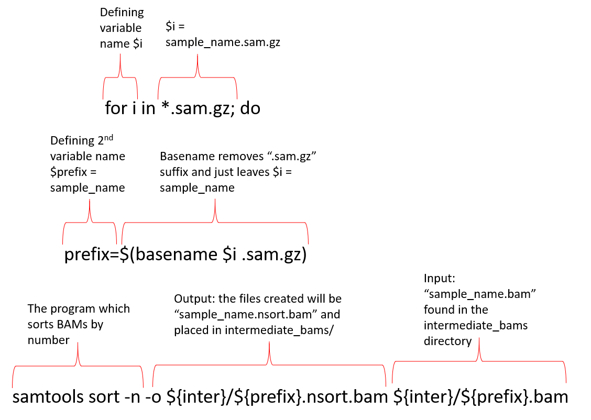

**Launch the app from username/data and RUN CELL ONE OF YOUR PERSISTANCE NOTEBOOK before starting.**

# SAM/BAM format
The [SAM file](https://genome.sph.umich.edu/wiki/SAM),
is a tab-delimited text file that contains information for each individual read and its alignment to the genome. While we do not
have time to go into detail about the features of the SAM format, the paper by
[Heng Li et al.](http://bioinformatics.oxfordjournals.org/content/25/16/2078.full) provides a lot more detail on the specification.

**The compressed binary version of SAM is called a BAM file.** We use this version to reduce size and to allow for *indexing*, which enables efficient random access of the data contained within the file.

We are going to be utilizing a series of tools from the program Samtools which will eventually allow us to identify SNPs unique to each mutant. Samtools allows for manipulating alignment files in the BAM format. The imported file to Samtools is the SAM (Sequence Alignment/MAP) format which will be sorted, merged, and indexed allowing us to more easily retrieve reads in our region of interest. [Link to manual pages for Samtools](http://www.htslib.org/doc/samtools.html).    

There are a series of 7 `for loops` that we will run. I will describe each step first.

## Step 1: SAM to BAM Conversion.

Samtools only works with the BAM file format, and thus we must first convert our SAM to BAM using samtools view. We will be utilzing `for loops` to minimize errors and improve efficiency. By defining variables early in the process, we can use these same variable names in all of our `for loops` rather than utilizing individual sample names (Figure 1). In addition to the working components of the for loop, we will also add echo commands which will just provide us with a visual cue that our commands are running.  

Figure 1: Breakdown of a `for loop`. This example provides a breakdown of the samtools view `for loop`. The formula for the `for loop` will remain mostly the same as we proceed through each of the samtools steps.

## Step 2: Sort BAM by name

We will use samtools sort twice during our analysis. For this sort, we are going sort our BAMs by name. This will generate our reads in alphabetical order with the read name at the top of the file. Name sorting is required for the next step in the process.

## Step 3: Fixmate on BAMs

Next we will use samtools fixmate which only works on name sorted BAMs. Fixmate will fix any errors that were made while aligning the paired-end reads.

## Step 4: Sort BAM by coordinates

Once the paired-end mates are fixed, we will use samtools sort a second time this time sorting by genomic coordinates. This is the default sorting method of samtools sort.

## Step 5: Mark and remove PCR duplicates

PCR duplicates are removed by a random sampling of the genome using samtools markdup. If you do random sampling of a genome, it is not likely you would see a bunch of sequences starting and ending at the same locations due to how the libraries for sequencing are generated. If there are samples that are represented at a statistically higher rate, these samples were likely overamplified, thus we remove them from the analysis to reduce our bias.

## Step 6: Index the markdup BAMs

Once we have removed the marked duplicates from our data set, we then index the alignments using samtools index. Indexing allows for a more efficient way to search for sequences of interest just as an index of a book helps you find the topic of interest more quickly.

## Step 7:

Lastly, we will calculate statistics of our reads using samtools flagstat.

To build the script, we are going to link the seven `for loops` together by using the `wait` command between each loop. When `wait` is used, the next loop will not begin until the sample has finished the first loop and so on. We also need to define some directories that we want our outputs sent to and where our inputs are located. I have started the script with commenting out the steps as a reminder to ourselves. The next set of comments describe where we want to launch the script, how we can log and watch the progress of the script, and the names we are going to use for our 2 output directories. We will want our results to land in `~/data/FlyCURE/results`. Our bwa_out directory is located in this location. Thus, we are going to create one directory called `intermediate_bams` to store results in the middle of the process and a second directory called `clean` where our final results will be output to. We have to give the relative path from where we are located when we launch the script. We start here: `~/data/FlyCURE/results/bwa_out` thus, to achieve this `~/data/FlyCURE/results/intermediate_bams` and `~/data/FlyCURE/results/clean` we can give the path of `../intermediate_bams` and `../clean`. It's standard notation to indent the lines between the `for` and the `done` to give you a visualization of what is in the `for loop`.

Create the script by opening nano and copying and pasting the script from here into your text file.

~~~
$ cd ~/data/FlyCURE/scripts
$ nano bam_factory.sh
~~~
{: .bash}

~~~
#!/bin/bash

# what I do:

# step 1: sam to bam conversion
# step 2: sort bam by name (samtools sort -n)
# step 3: fixmate on bam
# step 4: samtools sort by coordinate
# step 5: mark duplicates +remove (samtools markdup -r)
# step 6: indexes the markdup bam
# step 7: calculates the stats on that file

# run me in the folder with sam.gz (~/data/FlyCURE/results/bwa_out)
# if you want to save literal commands to a log file, run me like
# ../../scripts/bam_factory.sh > mylogfile.txt
# therefore,
# intermediate_bams folder is defined below as $inter
# clean folder is defined below as $clean

inter='../intermediate_bams'
mkdir -p $inter

clean='../clean_bams'
mkdir -p $clean

#this loop converts sam to bam
for i in *.sam.gz; do
  echo "converting $i to bam file"
  prefix=$(basename $i .sam.gz)
  echo samtools view -b -o ${inter}/${prefix}.bam $i
  samtools view -b -o ${inter}/${prefix}.bam $i &
done
wait

# sorting by name loop
for i in *.sam.gz; do
  echo "name sorting $i"
  prefix=$(basename $i .sam.gz)
  echo samtools sort -n -o ${inter}/${prefix}.nsort.bam ${inter}/${prefix}.bam &
  samtools sort -n -o ${inter}/${prefix}.nsort.bam ${inter}/${prefix}.bam &
done
wait

# fix mate loop
for i in *.sam.gz; do
  echo "fixmate $i"
  prefix=$(basename $i .sam.gz)
  echo samtools fixmate -r -m ${inter}/${prefix}.nsort.bam ${inter}/${prefix}.fixmate.bam &
  samtools fixmate -r -m ${inter}/${prefix}.nsort.bam ${inter}/${prefix}.fixmate.bam &
done
wait

# re-sort by coordinate
for i in *.sam.gz; do
  echo "coordinate sorting $i"
  prefix=$(basename $i .sam.gz)
  echo samtools sort -o ${inter}/${prefix}.csort.bam ${inter}/${prefix}.fixmate.bam &
  samtools sort -o ${inter}/${prefix}.csort.bam ${inter}/${prefix}.fixmate.bam &
done
wait

# markdup & remove pcr duplicates loop
for i in *.sam.gz; do
  echo "markdup removing dupes $i"
  prefix=$(basename $i .sam.gz)
  echo samtools markdup -r ${inter}/${prefix}.csort.bam ${clean}/${prefix}.markdup.bam &
  samtools markdup -r ${inter}/${prefix}.csort.bam ${clean}/${prefix}.markdup.bam &
done
wait

# index loop
for i in *.sam.gz; do
  echo "indexing $i"
  prefix=$(basename $i .sam.gz)
  echo samtools index ${clean}/${prefix}.markdup.bam &
  samtools index ${clean}/${prefix}.markdup.bam &
done
wait

# what I do:
# run flagstat on an indexed bam file and write that stat report to a log

# sorting by name loop
for i in *.sam.gz; do
  echo $index $bam to $log
  prefix=$(basename $i .sam.gz)
  echo samtools flagstat ${clean}/${prefix}.markdup.bam \> ${clean}/${prefix}.markdup.flags.log &
  samtools flagstat ${clean}/${prefix}.markdup.bam > ${clean}/${prefix}.markdup.flags.log &
done
~~~
{: .bash}

Make the script executable, navigate to `bwa_out`, and run the script!
~~~
$ chmod +x bam_factory.sh
$ cd ~/data/FlyCURE/results/bwa_out
$ ../../scripts/bam_factory.sh > bam_factory.log &
~~~
{: .bash}

The `&` at the ends of the commands just lets the script run in the background so we could continue to use the terminal if we wanted/needed to. This isn't all that important in our JupyterLab environment because we can open another terminal if needed. We can watch the progress of the script by using the command below. Expect this to take a day or overnight to run. If you want to exit tail or the log press `q`. DO NOT FORGET TO RUN YOUR NOTEBOOK WHEN THIS FINISHES.

~~~
$ tail -F bam_factory.log
~~~
{: .bash}

> ## Exercise
>
> Using the example I provided above for the samtools view `for loop`, breakdown one (or more) of the other `for loops` such as for samtools sort or samtools fixmate. You can define it such as I do and/or replace the variables with a sample > name to help you track what they all stand for.  
>
>> ## Solution
>>
>> 
>> Figure 2: Breakdown of a `for loop` for samtools sort.
>>
>> If you were to write the `for loop` for a single sample it would look like this:
>> ~~~
>> for A44.sam.gz
>>     do
>>     samtools sort -n -o intermediate_bams/A44.nsort.bam intermediate_bams/A44.bam
>> done
>> ~~~
>> {: .bash}
>>
>> Notice that I did not need to use `basename` because I was using the sample name itself. Alternatively, the for loop doesn't even need to be used in this case and you could
>> just use the samtools sort command directly.
>>
> {: .solution}
{: .challenge}

**RUN CELL TWO OF YOUR PERSISTANCE NOTEBOOK and let it complete before closing.**
