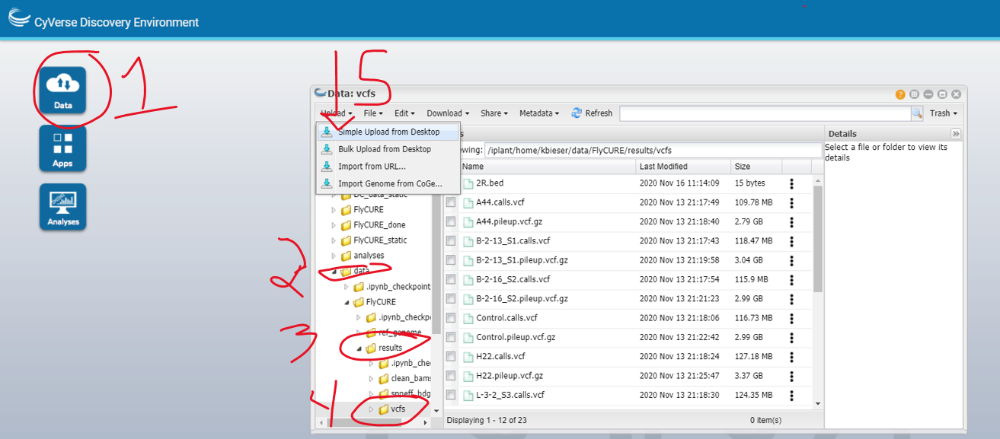

**DO NOT LAUNCH APP UNTIL YOU HAVE UPLOADED BED FILE**

# SnpEff and SnpSift to call unique SNPs

We currently have files in the vcf format (variant call format). These are call predictions that have been made, but they aren't in a format that is easily understandable to us. Additionally, at this point all we would know is their genomic coordinate, but we would not be easily able to identify if the SNP is in a gene, exon, intron, etc. We are going to use the program SnpEff which takes inputs of our predicted SNPs from the *.calls.vcf and constructs an output that annotates the variant calls and calculates the effects they may produce on known genes (i.e. are there amino acid changes and how likely is it to cause protein changes). We know from the experimental design that our mutants were generated utilizing ethyl methanesulfonate (EMS) which is known to produce random mutations by nucleotide substitution. Most often a transition is produced with an original G:C base pair becoming an A:T base pair. This is why we chose to not include indels in our previous analysis because we are not expecting an insertion or deletion from EMS mutagenesis. Additionally, we know from the experimental design that the mutation resides on chromosome 2R, thus we can limit the SNP calling to this region alone.     

[The link to snpEff](https://pcingola.github.io/SnpEff/se_introduction/)

# Upload the bed file to the vcfs directory

I have shared with each of you a file in the content library of your OneNote notebook, a 2R.bed file. You need to upload this into '~/data/FlyCURE/results/vcfs'. Download and save the 2R.bed file some where on your computer, then move into your Discovery Environment. Follow the steps below to upload the 2R.bed file into your `vcfs` directory. Once you click the "Simple Upload From Desktop" button, navigate to where you saved the 2R.bed file and upload. Once the file is uploaded, you can launch the app from your data directory.

**Launch the app from username/data and RUN CELL ONE OF YOUR PERSISTANCE NOTEBOOK before starting.**

# Load reference genome to snpEff

The snpEff program comes with preloaded genomes to use as a reference. We first need to download the reference genome into snpEff so it will be accessible by our script. We are going to navigate directly to the location the snpEff program is stored in our root directory.

~~~
$ cd /opt/conda/pkgs/snpeff-4.3.1t-2/share/snpeff-4.3.1t-2
~~~
{: .bash}

Since we are in a root level of our system we need to use `sudo` in front of our command to allow for specific user permissions. This will allow us to run the command at the root level. Run the following command to load the specific snpEff reference genome for _Drosophila melanogaster_.

~~~
$ sudo java -jar snpEff.jar download -v BDGP6.86
~~~
{: .bash}

You should see the following once the reference genome is downloaded. This should happen fast.
~~~
00:00:00        SnpEff version SnpEff 4.3t (build 2017-11-24 10:18), by Pablo Cingolani
00:00:00        Command: 'download'
00:00:00        Reading configuration file 'snpEff.config'. Genome: 'BDGP6.86'
00:00:00        Reading config file: /opt/conda/pkgs/snpeff-4.3.1t-2/share/snpeff-4.3.1t-2/snpEff.config
00:00:00        done
00:00:00        Downloading database for 'BDGP6.86'
00:00:00        Connecting to http://downloads.sourceforge.net/project/snpeff/databases/v4_3/snpEff_v4_3_BDGP6.86.zip
00:00:01        Following redirect: https://master.dl.sourceforge.net/project/snpeff/databases/v4_3/snpEff_v4_3_BDGP6.86.zip
00:00:01        Local file name: '/tmp/snpEff_v4_3_BDGP6.86.zip'
.......................
00:00:10        Donwload finished. Total 24342735 bytes.
00:00:10        Extracting file 'data/BDGP6.86/snpEffectPredictor.bin'
00:00:10        Creating local directory: '/opt/conda/pkgs/snpeff-4.3.1t-2/share/snpeff-4.3.1t-2/./data/BDGP6.86'
00:00:11        Unzip: OK
00:00:11        Deleted local file '/tmp/snpEff_v4_3_BDGP6.86.zip'
00:00:11        Done
00:00:11        Logging
00:00:12        Done.
~~~
{: .output}

# Build the snpEff and snpSift script

Move into your scripts directory.

~~~
$ cd ~/data/FlyCURE/scripts
$ nano snpeff_and_sift2R.sh
~~~
{: .bash}

Copy the following script into nano. Save and change the mode to executable.

~~~
#!/bin/bash
# what I do:
# I run snpEff
# First, I run a perlscript that came with SnpEff
# Then I run SnpSift to get a table of SNPs from the ANNotated vcfs
# Then I make sure they are unique in the 1st 6 fields
# Then I give them a name and have an 11 column test file output of SNPs that land in genes for each
# Sorts unique SNPs just on chromosome 2R
# Generates a tab delimited text file to view unique SNPs

#######################################

# Run me in the vcfs directory

outdir='../snpeff_bdgp6.86'
mkdir -p $outdir

region=2R.bed

ref=BDGP6.86

yourconfig="/opt/conda/pkgs/snpeff-4.3.1t-2/share/snpeff-4.3.1t-2/snpEff.config"

myopts="-c $yourconfig -fi $region -canon -no-downstream -no-intergenic -no-upstream -no-utr"
# myopts has additional flags that can be used to be more specific or more broad with SNPs called. We are using general flags that will identify any SNP that could affect protein function. This includes exons and splice sites.

# snpEff run on each called sample just in region 2R
for i in *.calls.vcf; do
  prefix=$(basename $i .calls.vcf)
  echo=running
  snpEff $myopts $ref ${i} > $outdir/${prefix}.calls.ann.vcf &
done
wait

# snpEff run on each called sample just in region 2R
for i in ${outdir}/*.calls.ann.vcf; do
  prefix=${i/.calls.ann.vcf/}
  cat $i | /opt/conda/pkgs/snpeff-4.3.1t-2/share/snpeff-4.3.1t-2/scripts/vcfEffOnePerLine.pl > ${prefix}.1ann.perline.vcf
  SnpSift extractFields ${prefix}.1ann.perline.vcf CHROM POS REF "ANN[*].ALLELE" "ANN[*].GENEID" "ANN[*].EFFECT" "ANN[*].HGVS_P" AF1 "ANN[*].IMPACT" "ANN[*].GENE" > ${prefix}.ann.txt
  grep -P '^\S+\t\S+\t\S+\t\S+\t\S+\t\S+\t' ${prefix}.ann.txt | uniq > ${prefix}.uniq.txt
  cut -sf 1-6 ${prefix}.uniq.txt | tr '\t' _ > ${prefix}.siteID
  paste ${prefix}.siteID ${prefix}.uniq.txt > ${prefix}.uniqID.txt
done
~~~
{: .bash}

## What the snpEff and snpSift script does

If we break down the script, you should notice we are going to run it on input files in our vcfs directory which were created when we ran bcftools. A new directory called `snpeff_bdgp6.86` will be created and will be where the output files will be sent. The `2R.bed` file is a simple text document defining the base pairs for chromosome 2R and `ref` is the genome for _D. melanogaster_ that we previously downloaded. The `yourconfig` line just tells the snpEff program where it can find it's configuration file.  

These are the options we are utilizing for our SNP selection:
  -fi , -filterInterval  <file>   : Only analyze changes that intersect with the intervals specified in this file
  -canon                       : Only use canonical transcripts.
  -no-downstream                  : Do not show DOWNSTREAM changes
  -no-intergenic                  : Do not show INTERGENIC changes
  -no-upstream                    : Do not show UPSTREAM changes
  -no-utr                         : Do not show 5_PRIME_UTR or 3_PRIME_UTR changes

There are additional options you could use which are viewable at the snpEff website. These options limit the potential mutations to protein coding regions including splice sites.

The snpSift program then takes the file generated by snpEff and essentially organizes the data in a way we will be more easily able to analyze. The `cat` commands calls a script within snpEff that calls one vcf per line and redirects the output. The items in the SnpSift line describe what information we want to keep. This includes:
  -chromosome (CHROM)
  -genomic coordinate (POS)
  -nucleotide present in the reference genome (REF)
  -nucleotide present in the stock fly (ANN[*].ALLELE)
  -gene ID (ANN[*].GENEID)
  -what gene region is affected (ie. intron, exon, etc.) (ANN[*].EFFECT)
  -variant in HGVS (DNA) notation - codon - (ANN[*].HGVS_P)
  -info field (AF1)
  -high, moderate, or low impact on protein (ANN[*].IMPACT)
  -name of gene (ANN[*].GENE)

The remaining 3 lines of the script are organizing the data in a tab delimited format.

# Run the script

Launch the script from your vcfs directory. Utilize `top` in a second terminal to watch it's status. This script should run in less than 10 minutes.

~~~
$ cd ~/data/FlyCURE/results/vcfs
$ ../../scripts/snpeff_and_sift2R.sh &
~~~
{: .bash}

# View the results

Once the analysis is complete, navigate to the outputs. You can then view the final output for each of the fly stocks. As you will see, although you can view the outputs, this isn't the easiest way to study the results. That's what we will work on in the next lesson.

~~~
$ cd ~/data/FlyCURE/results/snpeff_bdgp6.86
$ less A44.uniqID.txt
~~~
{: .bash}

There are two files that land in the vcfs directory. Move them to the snpeff_bdgp6.86 directory. The .html file is neat to look at but doesn't quite get us to the base calls that we need to analyze.

~~~
$ cd ~/data/FlyCURE/results/vcfs
$ mv snpEff* ../snpeff_bdgp6.86

**RUN CELL TWO OF YOUR PERSISTANCE NOTEBOOK and let it complete before closing.**
