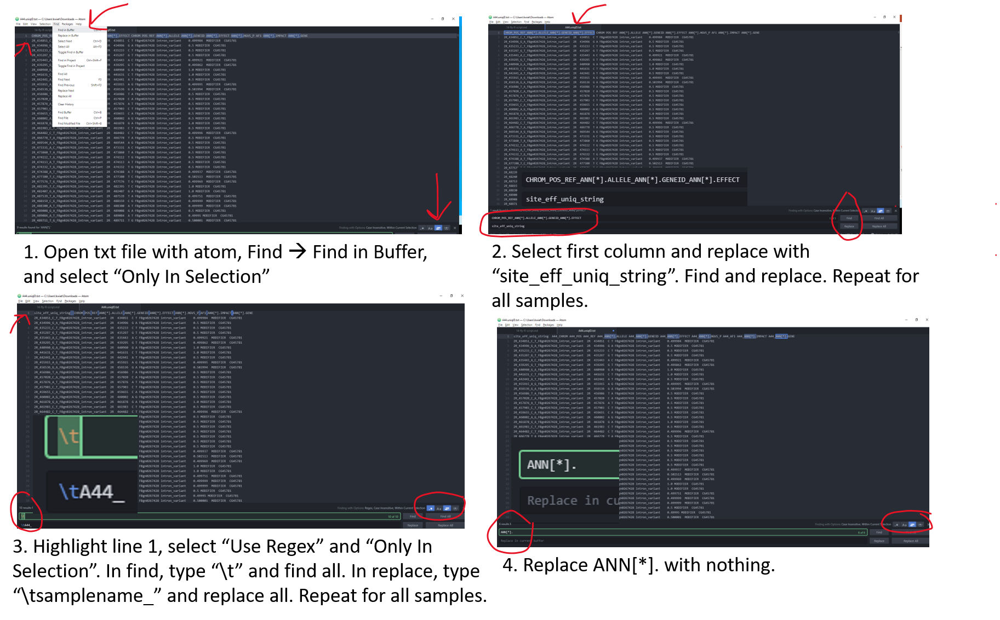

# Required Software

Download Atom Text Editor:
[Link to Atom Download](https://atom.io/)

Download R:
[Link to download R](https://repo.miserver.it.umich.edu/cran/)

Download Rstudio:
[Link to download Rstudio](https://rstudio.com/products/rstudio/download/)

# Downloading files from CyVerse to local machine

The final output of SnpEff and SnpSift generates a number of files. The file we need for our last analysis is the `*.uniqID.txt` for each of the 10 fly stocks. The first step will be to download them to your local machine in a new folder. We will be adding additional files to this folder. I have provided a video in Microsoft Stream describing these steps or follow Figure 1.


# Edit text files

You have already downloaded the text files that are required to your local machine and installed Atom or are using some other text editor. When snpSift was run, the script sorted the data into 11 columns each containing a column header. You can view these column headers in each of the text files or view them in CyVerse.

~~~
$ cd ~/data/FlyCURE/results/snpeff_bdgp6.86
$ head -n 1 A44.uniqID.txt
~~~
{: .bash}

~~~
CHROM_POS_REF_ANN[*].ALLELE_ANN[*].GENEID_ANN[*].EFFECT CHROM   POS     REF     ANN[*].ALLELE   ANN[*].GENEID   ANN[*].EFFECT   ANN[*].HGVS_P   AF1     ANN[*].IMPACT   ANN[*].GENE
~~~
{: .output}

As you can see, the column headers contain no sample specific identifying information and some of them are long. You should see the same 11 columns for each of the 10 fly stocks. The first step for the analysis will require us to edit the column headers so that each is identifiable by our sample/fly stock. There are a few different approaches you can utilize to edit the header. I demonstrate this in the Microsoft Stream video and in Figure 2. The header for each sample should be identical to the output below with the respective sample name substituted. Do not add spaces or periods in any of the sample names. (i.e. B.2.16 would be entered as B216).

~~~
site_eff_uniq_string	A44_CHROM	A44_POS	A44_REF	A44_ALLELE	A44_GENEID	A44_EFFECT	A44_HGVS_P	A44_AF1	A44_IMPACT	A44_GENE
~~~
{: .output}



# Open and load RStudio script

You should have already installed R and RStudio to your local machine. Additionally, you will need to download and save the `snpeff_bdgp6.Rmd` file located in the content library of our OneNote notebook to the same folder as your `*.uniqID.txt` files.

The next step is to open RStudio and create a New Project (Figure 3). Once the project is created you can open the `snpeff_bdgp6.Rmd` file which will load into your R project.


# Run the RStudio script

The purpose of this R script is to obtain a list of unique SNPs present in each of the mutant fly stocks. The input files for this script will be the text files generated from the SnpSift script that was the last step in our variant calling workflow in JupyterLab. Let's break down what each chunk (the official term in R) of code is doing.

~~~
---
title: "R Notebook"
output: html_notebook
---
~~~
{: .bash}

Chunk 1 is just the title of our notebook and it's output format.

~~~
```{r mylibs}
# library loading chunk
library("readr")
library(dplyr)
library(tidyr)
```
~~~
{: .bash}

Chunk 2 are three library's that are loaded into R to conduct our analysis. Below is a brief description of their functions. If R states you need to install updates, please do so.
  -readr: The goal of 'readr' is to provide a fast and friendly way to read rectangular data (like 'csv', 'tsv', and 'fwf').
  -dplyr: A package which provides a set of tools for efficiently manipulating datasets in R.
  -tidyr: Ensures your data is tidy and states every column is a variable, every row is an observation, and every cell is a single value.

Hit the play button.

~~~
```{r importing}
# data import chunk
frameA44<-read_tsv("./A44.uniqID.txt")
frameControl<-read_tsv("./Control.uniqID.txt")
framecos2<-read_tsv("./cos2.uniqID.txt")
frameH22<-read_tsv("./H22.uniqID.txt")
frameL31<-read_tsv("./L31.uniqID.txt")
frameB213<-read_tsv("./B-2-13_S1.uniqID.txt")
frameB216<-read_tsv("./B-2-16_S2.uniqID.txt")
frameL32<-read_tsv("./L-3-2_S3.uniqID.txt")
frameN11<-read_tsv("./N-1-1_S4.uniqID.txt")
frameN14<-read_tsv("./N-1-4_S5.uniqID.txt")
```
~~~
{: .bash}

Chunk 3 is our data importing chunk. R has an idea of where it is located just like our data structure in the terminal. Thus, if this R script is within the same folder as the `*.uniqID.txt` files, when this chunk is played, it should automatically be able to find the text files. Notice we are using `./` to indicate that the text files are "right here". If you start to receive any errors, one possibility is that your column headers aren't exactly as shown in the previous steps. Each of these chunks are written assuming the text headers as described in order to function.  

Hit the play button.  

~~~
```{r mega_join}
all_snp_frames <- frameA44 %>%
  full_join(frameControl, by = "site_eff_uniq_string") %>%
  full_join(framecos2, by = "site_eff_uniq_string") %>%
  full_join(frameH22, by = "site_eff_uniq_string") %>%
  full_join(frameL31, by = "site_eff_uniq_string") %>%
  full_join(frameB213, by = "site_eff_uniq_string") %>%
  full_join(frameB216, by = "site_eff_uniq_string") %>%
  full_join(frameL32, by = "site_eff_uniq_string") %>%
  full_join(frameN11, by = "site_eff_uniq_string") %>%
  full_join(frameN14, by = "site_eff_uniq_string")
```
~~~
{: .bash}

Chunk 4. We have named this chunk mega join, because we are joining all of the SNPs that were generated from our previous outputs. We are doing this by using the first column of each file (`site_eff_uniq_string`). This will generate an `all_genic_snps.tsv` file that will display what reference nucleotide (Ref = genomic reference) and mutant nucleotide (Allele = mutant stock) was identified for a specific genomic location from all of the fly stocks. If there is a difference in nucleotides at a specific genomic location, the Ref and Allele columns will display different nucleotides. If no nucleotides are displayed in these columns for a specific fly stock, that means there was no difference in nucleotides between Ref and Allele at those specific locations. This will be a very large file, but you can take a peak at it within R itself. The primary purpose of this step is to organize all of the 10 fly stocks in comparison to one another so that we can pull out only the SNPs that are unique to a single stock.   


Hit the play button.

~~~
```{r}
### select sets from the all_snp_frames
uniq2_A44<-all_snp_frames %>% filter(is.na(Control_POS),is.na(cos2_POS),is.na(H22_POS),is.na(L31_POS),is.na(L32_POS),is.na(B213_POS),is.na(B216_POS),is.na(N11_POS),is.na(N14_POS),A44_EFFECT!="synonymous_variant",A44_IMPACT!="MODIFIER") %>% select(site_eff_uniq_string,starts_with("A44"))
uniq2_cos2<-all_snp_frames %>% filter(is.na(Control_POS),is.na(A44_POS),is.na(H22_POS),is.na(L31_POS),is.na(L32_POS),is.na(B213_POS),is.na(B216_POS),is.na(N11_POS),is.na(N14_POS),cos2_EFFECT!="synonymous_variant",cos2_IMPACT!="MODIFIER") %>% select(site_eff_uniq_string,starts_with("cos2"))
uniq2_H22<-all_snp_frames %>% filter(is.na(Control_POS),is.na(cos2_POS),is.na(A44_POS),is.na(L31_POS),is.na(L32_POS),is.na(B213_POS),is.na(B216_POS),is.na(N11_POS),is.na(N14_POS),H22_EFFECT!="synonymous_variant",H22_IMPACT!="MODIFIER") %>% select(site_eff_uniq_string,starts_with("H22"))
uniq2_L31<-all_snp_frames %>% filter(is.na(Control_POS),is.na(cos2_POS),is.na(H22_POS),is.na(A44_POS),is.na(L32_POS),is.na(B213_POS),is.na(B216_POS),is.na(N11_POS),is.na(N14_POS),L31_EFFECT!="synonymous_variant",L31_IMPACT!="MODIFIER") %>% select(site_eff_uniq_string,starts_with("L31"))
uniq2_L32<-all_snp_frames %>% filter(is.na(Control_POS),is.na(cos2_POS),is.na(H22_POS),is.na(A44_POS),is.na(L31_POS),is.na(B213_POS),is.na(B216_POS),is.na(N11_POS),is.na(N14_POS),L32_EFFECT!="synonymous_variant",L32_IMPACT!="MODIFIER") %>% select(site_eff_uniq_string,starts_with("L32"))
uniq2_B213<-all_snp_frames %>% filter(is.na(Control_POS),is.na(cos2_POS),is.na(H22_POS),is.na(A44_POS),is.na(L32_POS),is.na(L31_POS),is.na(B216_POS),is.na(N11_POS),is.na(N14_POS),B213_EFFECT!="synonymous_variant",B213_IMPACT!="MODIFIER") %>% select(site_eff_uniq_string,starts_with("B213"))
uniq2_B216<-all_snp_frames %>% filter(is.na(Control_POS),is.na(cos2_POS),is.na(H22_POS),is.na(A44_POS),is.na(L32_POS),is.na(B213_POS),is.na(L31_POS),is.na(N11_POS),is.na(N14_POS),B216_EFFECT!="synonymous_variant",B216_IMPACT!="MODIFIER") %>% select(site_eff_uniq_string,starts_with("B216"))
uniq2_N11<-all_snp_frames %>% filter(is.na(Control_POS),is.na(cos2_POS),is.na(H22_POS),is.na(A44_POS),is.na(L32_POS),is.na(B213_POS),is.na(B216_POS),is.na(L31_POS),is.na(N14_POS),N11_EFFECT!="synonymous_variant",N11_IMPACT!="MODIFIER") %>% select(site_eff_uniq_string,starts_with("N11"))
uniq2_N14<-all_snp_frames %>% filter(is.na(Control_POS),is.na(cos2_POS),is.na(H22_POS),is.na(A44_POS),is.na(L32_POS),is.na(B213_POS),is.na(B216_POS),is.na(N11_POS),is.na(L31_POS),N14_EFFECT!="synonymous_variant",N14_IMPACT!="MODIFIER") %>% select(site_eff_uniq_string,starts_with("N14"))
```
~~~
{: .bash}

Chunk 5 conducts pair-wise comparisons between the first stock listed (i.e. uniq2_A44) to each of the other 9 fly stocks. This will ultimately generate a list of SNPs that are present only in this particular stock (i.e. mutant stock A44).

Hit the play button.

~~~
```{r}
### file export
uniq2_A44 %>% write_tsv("./prioritySNPs_A44.tsv")
uniq2_cos2 %>% write_tsv("./prioritySNPs_cos2.tsv")
uniq2_H22 %>% write_tsv("./prioritySNPs_H22.tsv")
uniq2_L31 %>% write_tsv("./prioritySNPs_L31.tsv")
uniq2_L32 %>% write_tsv("./prioritySNPs_L32.tsv")
uniq2_B213 %>% write_tsv("./prioritySNPs_B213.tsv")
uniq2_B216 %>% write_tsv("./prioritySNPs_B216.tsv")
uniq2_N11 %>% write_tsv("./prioritySNPs_N11.tsv")
uniq2_N14 %>% write_tsv("./prioritySNPs_N14.tsv")
all_snp_frames %>% write_tsv("./all_genic_snps_all.tsv")
```
~~~
{: .bash}

Chunk 6 exports the data to a tab-delimited format that you can open in excel using the default prompts. After you hit the play button you should see new files in the folder that the original text files are in. I suggest opening excel and then opening each of the files from there. Give yourself a big pat on the back as you have just finished the bioinformatics analysis pipeline in our quest to identify the causative SNP in each of the fly mutants!

**But now what?!?!**
